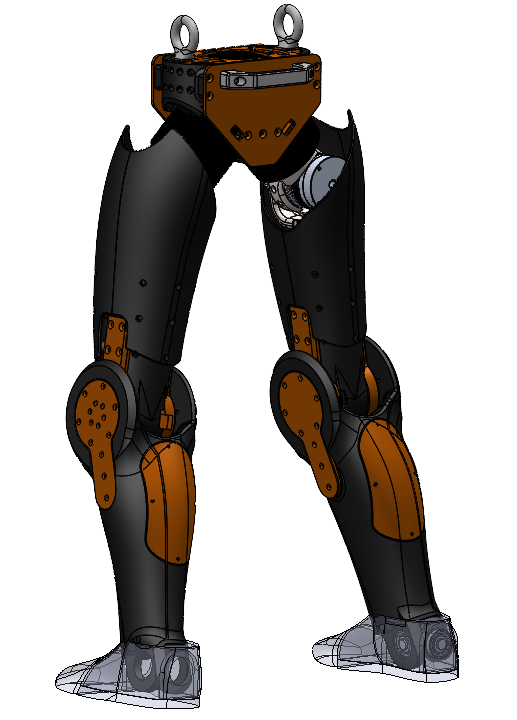
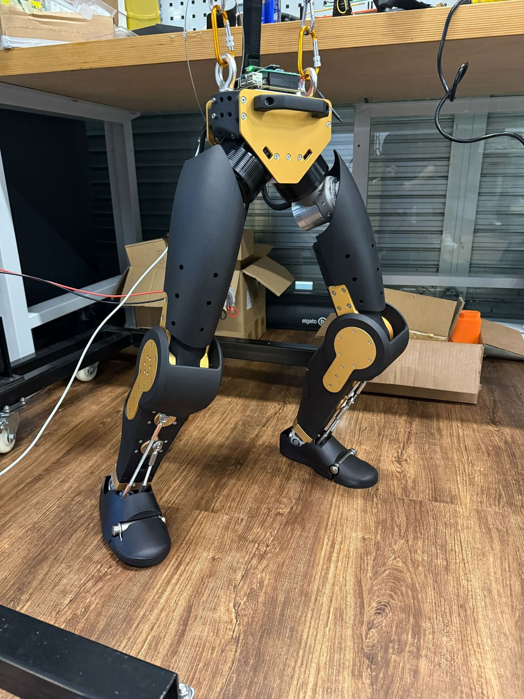

# Asimov Locomotion

Fork of [mujocolab/mjlab](https://github.com/mujocolab/mjlab) for the Asimov bipedal robot.

<p align="center">
  
  &nbsp;&nbsp;&nbsp;&nbsp;
  
</p>

---

## Demo

**Sim2Sim in MuJoCo** - Multi-directional velocity tracking:

<p align="center">
  
</p>

---

## Robot Modeling

**12-DOF bipedal** (6 per leg): `hip_pitch`, `hip_roll`, `hip_yaw`, `knee`, `ankle_pitch`, `ankle_roll`

Key characteristics:
- **Canted hip pitch axis** (45° tilt) - unique kinematics vs standard humanoids
- **Asymmetric left/right joint axes** - opposite signs for symmetric motion
- **Narrow stance** (11.3cm) - requires conservative velocity limits

---

## Training

### Reward Structure

| Reward | Description |
|--------|-------------|
| **Velocity tracking** | Track commanded (vx, vy, ωz) |
| **Imitation** | Match walking reference @ 1.25Hz gait |
| **Alternating feet** | Enforce bipedal gait pattern |
| **Pose** | Joint-specific variance (larger for canted hips, tight for ankles) |
| **Air time** | Encourage dynamic stepping (light robot) |
| **Self-collision** | Penalize inter-link collisions |

### Configuration

- PPO with adaptive LR, 5k iterations
- Terrain curriculum
- Network: `(256, 256, 128)` - sized for 12-DOF

### Adaptations vs G1

- Conservative velocity limits due to narrow 11.3cm stance
- Higher `body_ang_vel` penalty (-0.08) for narrow-stance stability
- Tight ankle pose constraints (limited ROM: ~±30° pitch, ±6° roll)
- Larger hip variance in pose reward (canted axis couples roll/pitch)
- Gait clock observation for phase-aware control

---

## Observations (Policy)

| Observation | Source |
|-------------|--------|
| `base_ang_vel` | IMU |
| `projected_gravity` | IMU |
| `velocity_command` | (vx, vy, ωz) |
| `joint_pos` | Relative to default pose |
| `joint_vel` | Joint velocities |
| `previous_actions` | Action history |
| `gait_clock` | [cos(φ), sin(φ)] @ 1.25Hz for phase-aware control |

**Removed:** `base_lin_vel` (no state estimator on real robot)

---

## Sim2Real

- **Physics-based PD gains:** KP = J_reflected × ωn² (10Hz), KD = 5.0 Nm·s/rad (hardware max)
- **Zero pose** used as default (mechanically stable)

---

## Quick Start

```bash
# Install uv if you haven't already
curl -LsSf https://astral.sh/uv/install.sh | sh

# Clone and run
git clone https://github.com/menloresearch/asimov-mjlab.git
cd asimov-mjlab
uv sync
```

### Train Asimov Velocity Policy

```bash
uv run train Mjlab-Velocity-Flat-Asimov --env.scene.num-envs 4096
```

### Evaluate Policy

```bash
uv run play Mjlab-Velocity-Flat-Asimov --wandb-run-path your-org/mjlab/run-id
```

---

## License

Licensed under the [Apache License, Version 2.0](LICENSE).

Based on [mjlab](https://github.com/mujocolab/mjlab) by MuJoCo Lab.
